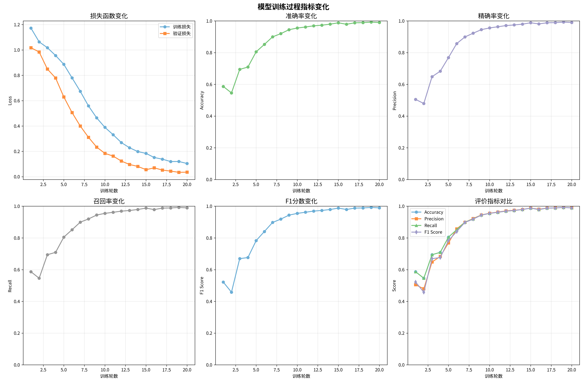
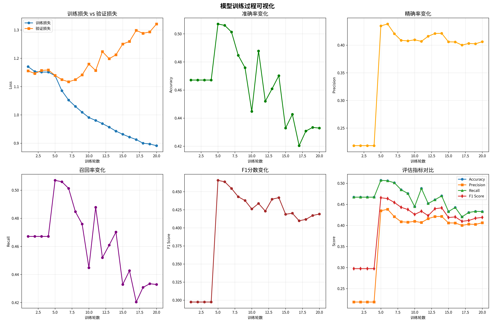

# AI4Edu-Group10-QDP

### **项目简介**：这是一个题目难度预测的模型

### 该模型使用了`Bert-base-chinese` + `BiLSTM` + `Attention` + `HighwayNetwork`

该项目会预测出题目的五个难度，分别是容易，较易，一般，较难，困难

目录列表

```txt
AI4Edu-Group10-QDP
├── app.py
├── assert # Loss和其他评估的图片
├── data
│   └── test/train/validation # 测试集/训练集/验证集
├── models # 模型代码
├── test.py # 测试代码
├── train.py # 训练代码
├── utils # 工具库
│    ├── checkmate.py
│    ├── data_helper.py
│    └── param_parser.py
├── README.md
└──requirements.txt # 依赖
```

#### **小组成员**：

|  姓名  |    学号    |               分工                |
| :----: | :--------: | :-------------------------------: |
|  柴硕  | 2023013323 |    模型的编写，数据集处理编写     |
| 白汶卓 | 2023012094 | Web页面制作，模型改进，数据集收集 |
| 卞东博 | 2023012716 |     参数调整，注意力机制编写      |

#### 依赖安装：

读取文件目录下的requirements.txt 获取依赖，安装命令

```bash
pip install -r requirements.txt
```

```txt
grpcio==1.76.0
hf-xet==1.2.0
huggingface-hub==0.36.0
modelscope==1.33.0
networkx==3.6.1
numpy==2.3.5
pandas==2.3.3
pillow==12.0.0
scikit-learn==1.8.0
sympy==1.14.0
tensorboard==2.20.0
tensorboard-data-server==0.7.2
texttable==1.7.0
tokenizers==0.22.1
torch==2.9.1+cu126
torchvision==0.24.1+cu126
tqdm==4.67.1
transformers==4.57.3
streamlit==1.52.1
```

数据集采用的是`CJEval` 下载地址：https://github.com/SmileWHC/CJEval

我们对数据集进行了整合和标签数目的均分

#### 使用说明：

训练代码示例

```bash
python train.py
```

如果想使用自定义参数，使用如下代码来查看自定义参数

```bash
python train.py --help
```

测试代码示例

```bash
python test.py
```

如果想使用自定义参数，使用如下代码来查看自定义参数

```bash
python test.py --help
```

参数

```txt
python train.py/test.py --help
usage: train.py [-h] [--train-file [TRAIN_FILE]] [--validation-file [VALIDATION_FILE]] [--test-file [TEST_FILE]]
                [--rnn-layers RNN_LAYERS] [--rnn-dim RNN_DIM] [--attention-dim ATTENTION_DIM]
                [--attention-type ATTENTION_TYPE] [--fc-dim FC_DIM] [--dropout-rate DROPOUT_RATE] [--epochs EPOCHS]
                [--batch-size BATCH_SIZE] [--learning-rate LEARNING_RATE] [--decay-rate DECAY_RATE]
                [--decay-steps DECAY_STEPS] [--norm-ratio NORM_RATIO] [--l2-lambda L2_LAMBDA]
                [--num-checkpoints NUM_CHECKPOINTS] [--num-classes NUM_CLASSES] [--bert-name BERT_NAME]
                [--bert-path BERT_PATH] [--bert-mod BERT_MOD] [--include-knowledge INCLUDE_KNOWLEDGE]
                [--include-analysis INCLUDE_ANALYSIS]

Run Model.

options:
  -h, --help show this help message and exit
  --train-file [TRAIN_FILE] Training data.
  --validation-file [VALIDATION_FILE] Validation data.
  --test-file [TEST_FILE] Testing data.
  --rnn-layers RNN_LAYERS Number of RNN layers.
  --rnn-dim RNN_DIM     RNN hidden dimension.
  --attention-dim ATTENTION_DIM Attention dimension.
  --attention-type ATTENTION_TYPE Attention type (normal, cosine, mlp).
  --fc-dim FC_DIM Fully connected layer dimension.
  --dropout-rate DROPOUT_RATE Dropout rate.
  --epochs EPOCHS Number of training epochs.
  --batch-size BATCH_SIZE Batch Size.
  --learning-rate LEARNING_RATE Learning rate.
  --decay-rate DECAY_RATE Rate of decay for learning rate.
  --decay-steps DECAY_STEPS How many steps before decay learning rate.
  --norm-ratio NORM_RATIO The ratio of the sum of gradients norms of trainable variable.
  --l2-lambda L2_LAMBDA L2 regularization lambda.
  --num-checkpoints NUM_CHECKPOINTS Number of checkpoints to store.
  --num-classes NUM_CLASSES Number of classes for classification task.
  --bert-name BERT_NAME name of bert model
  --bert-path BERT_PATH the path of bert model
  --bert-mod BERT_MOD   BERT mod (local or net)
  --include-knowledge INCLUDE_KNOWLEDGE Whether to include knowledge points in text.
  --include-analysis INCLUDE_ANALYSIS Whether to include question analysis in text.
```

### Web界面启动

使用如下命令来启动Web页面，请确保目录下存在训练好的模型

```bash
streamlit run app.py
```

### 数据集对比和LOSS等信息展示

|  Dataset  | Line_size | Label_0 | Label_1 | Label_2 | Label_3 | Label_4 |
| :-------: | :-------: | :-----: | :-----: | :-----: | :-----: | :-----: |
| Dataset A |   11990   |  2583   |  2350   |  2867   |  2543   |  1647   |
| Dataset B |   10168   |  3803   |  2580   |  2761   |   524   |   500   |

这是在Dataset A上做的测试结果，可以发现效果很好



这是在Dataset B上做的测试的结果，发现训练损失下降，但验证损失一直上升，主要是模型参数和训练集分布不好


